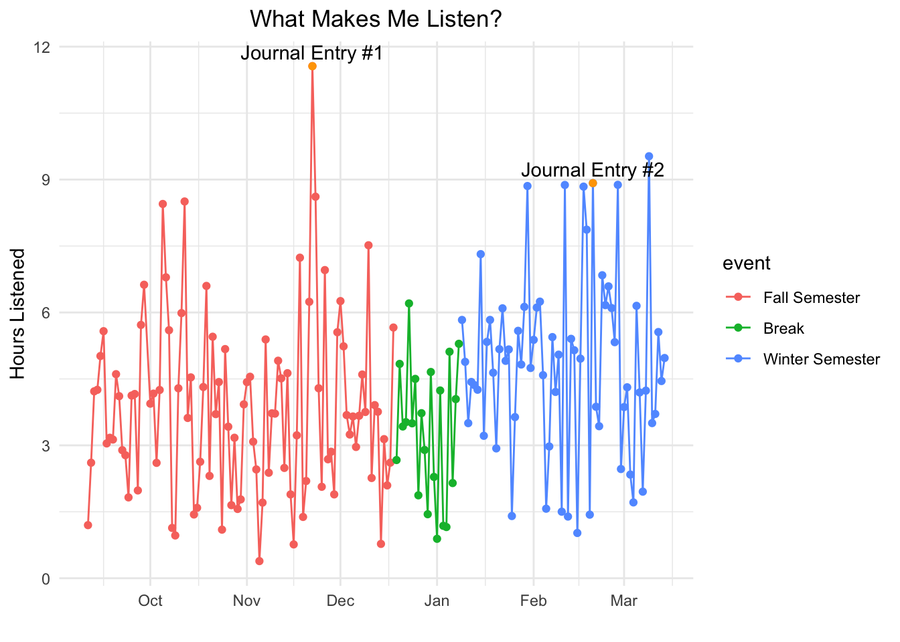
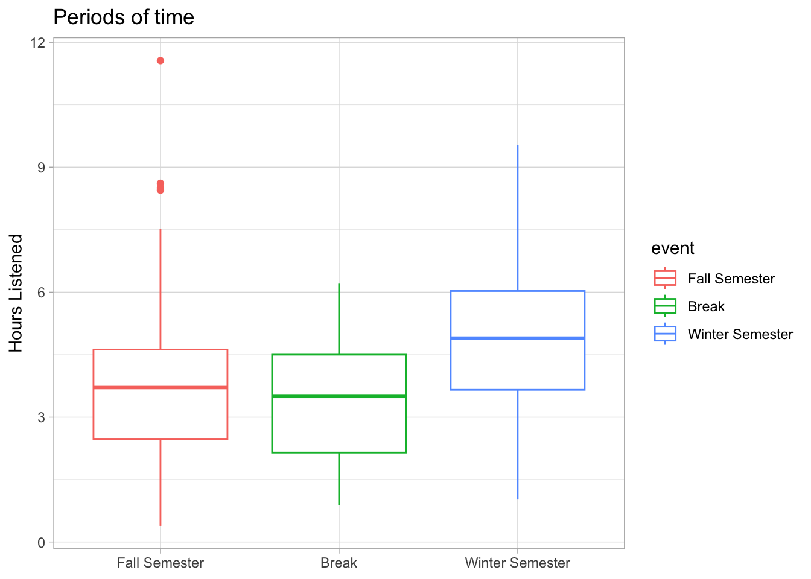
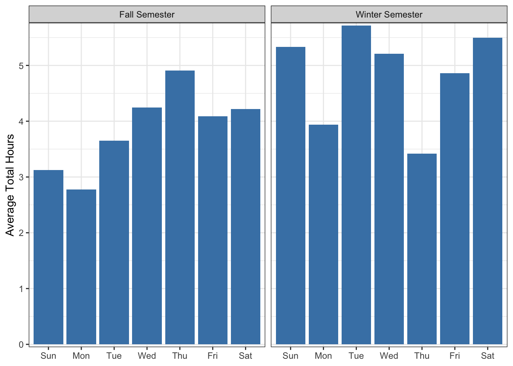
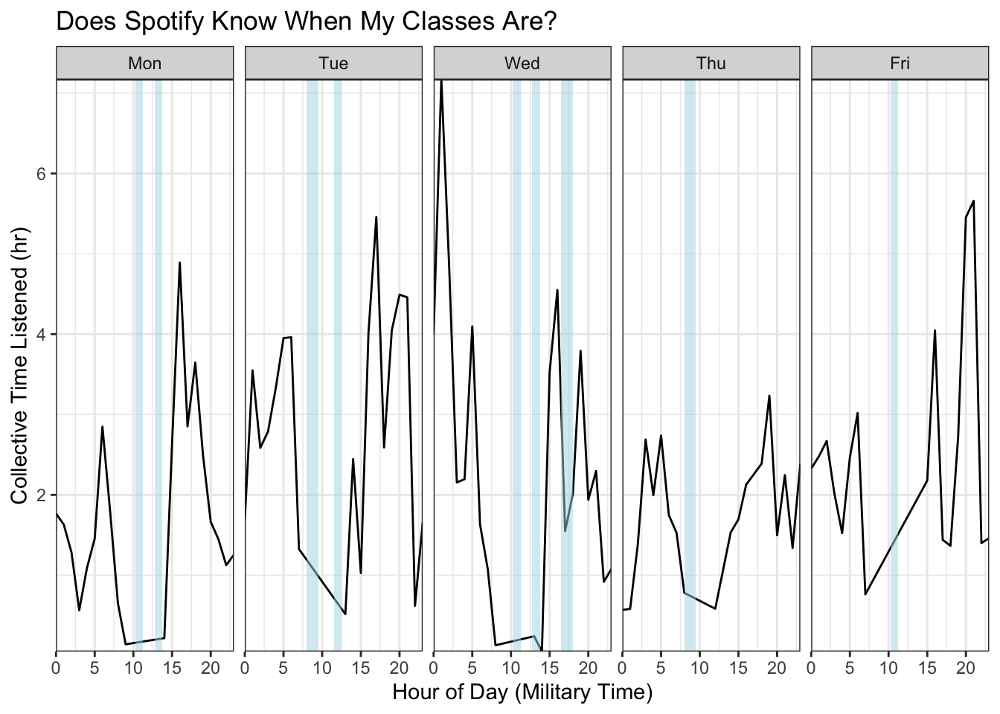

::: {.cell}

```{.r .cell-code}
knitr::opts_chunk$set(warning = FALSE, message = FALSE) 
```
:::

::: {.cell}

```{.r .cell-code}
library(tidyverse)
library(jsonlite)


# Combinding brook data
brook_data_one <- fromJSON("data/StreamingHistory_music_0.json")
brook_data_two <- fromJSON("data/StreamingHistory_music_1.json")
brook_data_three <- fromJSON("data/StreamingHistory_music_2.json")
brook_data_four <- fromJSON("data/StreamingHistory_music_3.json")

brook_all <- bind_rows(brook_data_one, brook_data_two, brook_data_three, brook_data_four)


# Use Lubridate to format datetiems as wanted
brook_all <- brook_all %>% 
    mutate(endTime = ymd_hm(endTime))
```
:::


## Up Front 
I listen to a lot of music. Over Fall and Winter semesters, on average I listened to 
just over 4 hours of music each day. In the span of a little over 6 months, I have
streamed **766.5 hours** of music! When I learned this I became curious about 
what things influence my listening. Pairing the data exploration with my journal
entries, I found some interesting insights! 


## Looking at the Big Picture

*Some details were minorly changed to not be too personal.*

##### Journal Entry #1 - Day before Thanksgiving
> Nov 22nd, 2023 \
> "Today was hard! We ended up driving two cars down to Utah so I drove one with Ethan...Today I have just been extra grumpy...
>[Later] it was nice though because I got to spend time in the kitchen alone cooking. hehe. I made a sugar-free apple pie, 2 pumpkin pies, and jello. Then I cleaned up for tomorrow."


##### Journal Entry #2 - Ending a Relationship
> Feb 20th, 2024 \
> "Yesterday I got the strongest confirmation from God that it's okay for me to focus for a season on my career and education...
> These feelings led me to end things with [Daniel] (which has been sad). I mean [there were other reasons] but I felt confident [in] ending the romantic side [of the relationship] for a time"


::: {.cell}

```{.r .cell-code}
# Build a visual (For Fall and Winter Semester)
brook_recent_days <- brook_all %>%
    mutate(date = date(endTime)) %>%
    group_by(date) %>%
    summarize(total_ms = sum(msPlayed)) %>%
    mutate(
        total_min = total_ms / 60000,
        total_hr = total_min / 60,
        event = case_when(
            date >= as.Date("2023-09-11") & date <= as.Date("2023-12-18") ~ "Fall Semester",
            date >= as.Date("2023-12-18") & date <= as.Date("2024-01-08") ~ "Break",
            date >= as.Date("2024-01-09") & date <= as.Date("2024-03-14") ~ "Winter Semester"
        ),
        day_of_week = wday(date, label=TRUE), 
        event = factor(event, levels=c("Fall Semester", "Break", "Winter Semester"))
    ) %>%
    filter(between(date, as.Date("2023-09-11"), as.Date("2024-03-14")))


high_df <- data.frame(
    date = c(as.Date("2023-11-22")),
    total_hr = 11.56
)

journal_two <- data.frame(
    date = c(as.Date("2024-02-20")),
    total_hr = 8.92
)

ggplot(brook_recent_days, aes(x=date, y=total_hr)) +
    geom_line(aes(color=event)) +
    geom_point(aes(color=event)) +
    geom_point(data=high_df, aes(x=date, y=total_hr), color="orange") +
    geom_text(data=high_df, aes(x=date, y=total_hr, label="Journal Entry #1"),
        vjust = -0.5, hjust = 0.5
    ) +
    geom_point(data=journal_two, aes(x=date, y=total_hr), color="orange") +
    geom_text(data=journal_two, aes(x=date, y=total_hr, label="Journal Entry #2"),
        vjust = -0.5, hjust = 0.5
    ) +
    xlab("") +
    scale_x_date(
        # limit=c(as.Date("2023-09-11"), as.Date("2024-03-14")),
        date_labels= "%b",
        date_breaks = "1 month"
    ) +
    labs(y= "Hours Listened", title="What Makes Me Listen?", legend="Event") +
    theme_minimal() +
    theme(
        plot.title = element_text(hjust=0.5)
    )
```

::: {.cell-output-display}
{width=672}
:::
:::


*There is no journal entry on the last high point in March*

Another cool trend to see from this visual is that during the break, my listening time dropped. 
Let's look closer into this.


::: {.cell}

```{.r .cell-code}
ggplot(brook_recent_days, aes(x=event, y=total_hr, color=event))+
    geom_boxplot() +
    labs(x=NULL, y= "Hours Listened", title="Periods of time") +
    theme_light()
```

::: {.cell-output-display}
{width=672}
:::
:::


We can see that possibly in the previous visual it wasn't that the average is necessarily low but rather that during the semesters, I am more likely to have outliers or long days of listening. 

Seeing that two of the outliers as seen on the first graph are tied to events in my life, it also could be that because there are only 21 days in the break, it is a lot more likely for me to not experience an event to trigger a high listening day. This added to the fact that I am around family during the breaks (and my parents don't like headphones in) could account for the slight dip and lack of outliers.

#### Does my schedule affect my listening?

To approach this question, I looked at my listening average for each day of the week each period of time. Besides the fact that it appears I'm listening to more music over Winter semester in general, we can also see the average time matches what you'd expect based on my schedule.  


::: {.cell}

```{.r .cell-code}
brook_semesters <- brook_recent_days %>%
    filter(event != "Break")

ggplot(brook_semesters, aes(x = day_of_week, y = total_hr)) +
  facet_wrap(~event) +
  stat_summary(fun = "mean", geom = "col", fill = "steelblue") +
  labs(y = "Average Total Hours", x=NULL) +
  theme_bw() +
  scale_y_continuous(expand = c(0, 0.05))
```

::: {.cell-output-display}
{width=672}
:::
:::


##### My Schedule (by hours of committments)
**Fall**\
Sunday - 2 hours\
Monday - 6 hours\
Tuesday - 6 hours\
Wednesday - 4 hours\
Thursday - 2 hours\
Friday - 2 hours\
Saturday - 0 hours\

**Winter**\
Sunday - 2 hours\
Monday - 6 hours\
Tuesday - 3 hours\
Wednesday - 4 hours\
Thursday - 5 hours\
Friday - 2 hours\
Saturday - 0 hours\

Knowing my schedule, these numbers make sense. When my commitment time is high, my listening time is low.

The fact that I can vaguely map my schedule based on the number of hours I listen to music is crazy. It shows the kind of information that Spotify can assume about you based on your listening habits. This is just on the average too, what if we looked at each day of the week and what the listening looked like through the hours?


### Does Spotify know my schedule?

To answer this question, I decided to zoom in and just look at Winter semester. Because the values on msListened are tied to the endTime this made finding the average a little weird and so I decided to simply sum the number of milliseconds for each hour and group to make the graph.


::: {.cell}

```{.r .cell-code}
brook_winter_semester <- brook_all %>%
    mutate(
        date = date(endTime),
        hour = hour(endTime)
    ) %>%
    filter(
        between(date, as.Date("2024-01-09"), as.Date("2024-03-14")),
        trackName != "r0ut1n3 - Gamers Mix"
    ) %>%
    group_by(date, hour) %>%
    summarize(
        time_listened = sum(msPlayed) / 3600000,
        number_of_tracks = n()
    ) %>%
    mutate(
        day_of_week = wday(date, label=TRUE)
    ) %>% 
    filter(day_of_week %in% c("Mon", "Tue", "Wed", "Thu", "Fri"))


day_plot <- ggplot(brook_winter_semester, aes(x=hour, y=time_listened)) +
    facet_wrap(~day_of_week, nrow = 1) +
    stat_summary(fun = "sum", geom = "line") 
    # geom_vline(xintercept = 12, color="red", linetype="dashed") 
    

day_order <- c("Mon", "Tue", "Wed", "Thu", "Fri")

class_shades <- data.frame(
    day_of_week = c("Mon", "Mon", "Tue", "Tue", "Wed", "Wed", "Wed", "Thu", "Fri"),
    xmin = c(10.25, 12.75, 8, 11.5, 10.25, 12.75, 16.5, 8, 10.25),
    xmax = c(11.25, 13.75, 9.5, 12.5, 11.25, 13.75, 18, 9.5, 11.25),
    ymin = -Inf,
    ymax = Inf,
    time_listened = 5,
    hour = 5
) %>%
mutate(
    day_of_week = factor(day_of_week, levels=day_order)
)


day_plot + geom_rect(
    data=class_shades,
    aes(xmin=xmin,
        xmax=xmax,
        ymin = ymin,
        ymax = ymax), fill = "lightblue",
    alpha = 0.5
) +
theme_bw() +
coord_cartesian(expand = FALSE) +
labs(
    x="Hour of Day (Military Time)",
    y="Collective Time Listened (hr)",
    title="Does Spotify Know When My Classes Are?"
)
```

::: {.cell-output-display}
{width=672}
:::
:::


The blue shows when I have class (devotional is also included and for the most part, this lines up to the low listening points for my week! I even have higher averages when I am sleeping (which makes sense because there are dogs that bark upstairs).

I wouldn't go far enough to say that you can know when my classes are, however they can see when I have a regular event that involves not being on Spotify.

### Conclusion 

I have only scratched the surface of the data Spotify holds about me. Because each person's listening patterns differ, it might be hard to say Spotify can predict anything from these patterns. When you have both sides though, the patterns become more clear, and from my data, you can glean information about my life.


### What's next?

- **Look at the mean for the previous events as well** I have data back to when I first got my account. I could tie each day to the event that was happening at that time and look at how my listening changes based on the phase of my life.

- **Find average BPM for each day** This has the potential to show if I listen to slower music on Sunday, and how being in school changed the speed of my music. 

- **Who do I listen to** This question would be fun to explore if my listening tastes (in terms of the artist) change when I'm listening to a lot of music.

*For this project, I also pulled a lot of data from Spotify's API that I ended up not using.*


